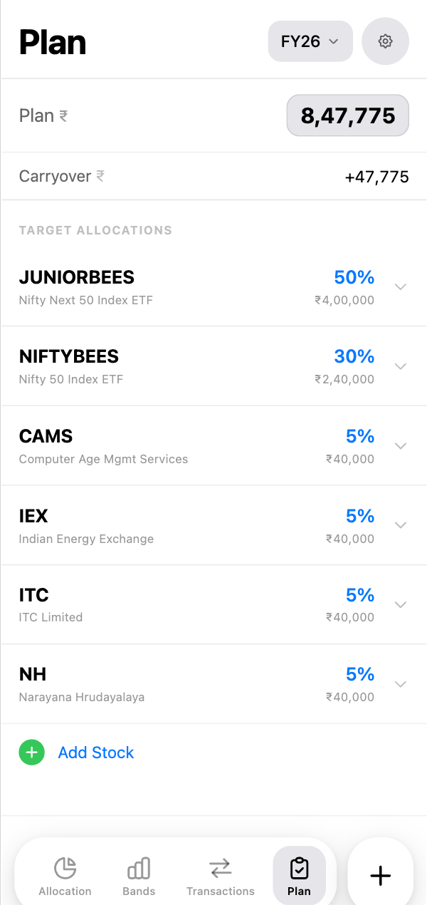
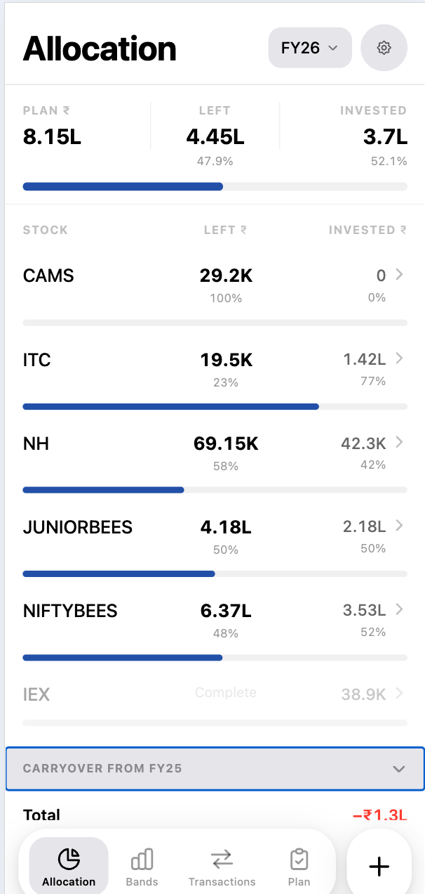
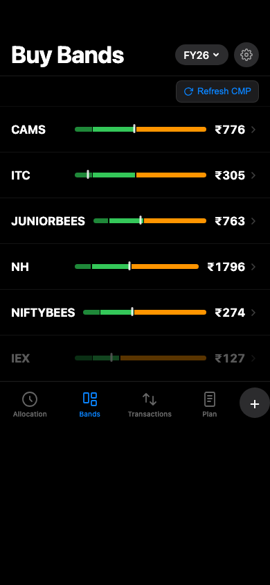
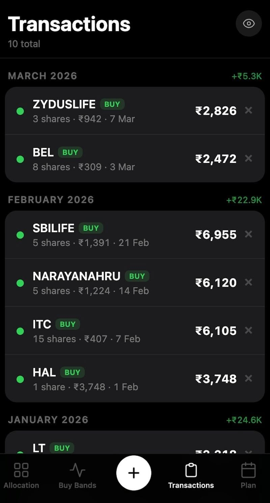

# Haku

Haku is a simple planner for Indian markets: set a yearly budget → allocate across stocks → let AI generate buy bands → log trades as you go → track plan vs remaining budget.

Most apps let you monitor existing investments. Haku is for planning them.

---

## Contents

- [The Problem](#the-problem)
- [The Solution](#the-solution)
- [AI Features](#ai-features)
- [Security](#security)
- [Docs](#docs)

  
  
  
  

---

## The Problem

Most apps let you monitor existing investments — but the planning happens outside the app, on ad-hoc spreadsheets, scattered notes, and reminders. This means:
- An Excel sheet for per-stock allocation budgets
- Notes across devices for buy price targets
- No single view of: what's the plan, how much is deployed, is now a good price to add?

The result is a tracker to track your trackers — too much friction to follow consistently year after year.

---

## The Solution

Haku brings the entire annual investment workflow into one place:

1. **Plan your year** — set a total budget, add stocks, assign allocation percentages by category
2. **AI-powered buy bands** — Gemini AI fetches live financials and computes valuation zones per stock
3. **Log transactions** — manual entry, grouped by month with buy/sell totals
4. **Track deployment** — see exactly how much of each stock's budget is deployed vs remaining
5. **Carryover** — unspent budget from one FY carries into the next plan automatically

No brokerage integration. No auto-sync. Intentionally deliberate.

---

## AI Features

Band generation uses **Gemini 2.5 Flash** with Google Search grounding:
- **Stocks**: fetches EPS, operating profit, borrowings, cash, shares from Screener.in → applies category-specific PE/EV-EBITDA/PB multiples
- **Index/ETFs**: fetches Nifty PE + ETF price → derives implied EPS → applies PE band
- **Auto-tranches**: generates up to 5 buy tranches per stock, distributed within the Buy zone (skewed toward lower prices), qty sized from remaining FY budget

To use AI generation, add your own Gemini API key in **Settings** (tap the profile icon). Free keys available at [aistudio.google.com](https://aistudio.google.com).

---

## Security

- All data stored in Supabase with Row Level Security (RLS) — users can only access their own data
- Gemini API keys stored encrypted at rest, never returned to the client after save
- No third-party analytics or tracking

---

## Docs

| Document | Description |
|----------|-------------|
| [docs/guide.md](docs/guide.md) | New user walkthrough — setup, screens, and flow |
| [docs/product.md](docs/product.md) | App model — vocabulary, screens, investment math |
| [docs/valuation.md](docs/valuation.md) | Valuation rules — band multiples, signals, tranches |
| [docs/architecture.md](docs/architecture.md) | Technical details — schema, band calculator, AI flow, security, setup |
| [docs/design.md](docs/design.md) | Design system — typography, colour tokens, component contracts |

---

## Built with

Vibe-coded with [Claude Code](https://claude.ai/code). Stack: Next.js 16, TypeScript, Tailwind CSS, Supabase, Gemini 2.5 Flash.
