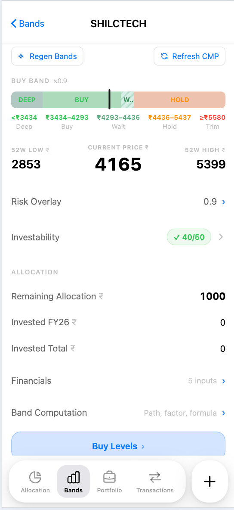
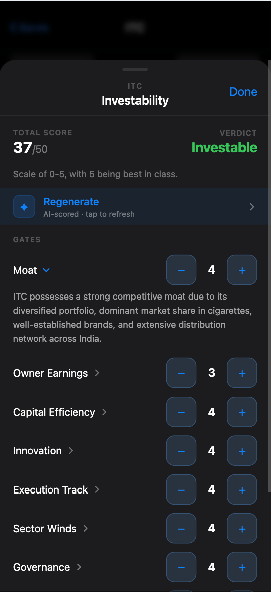
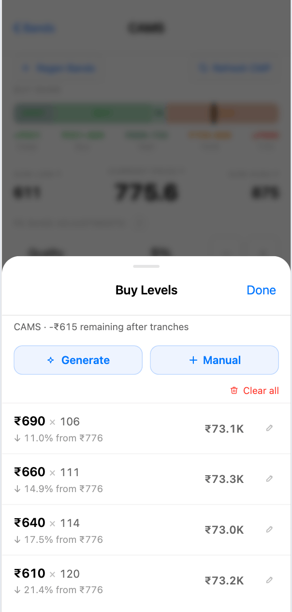
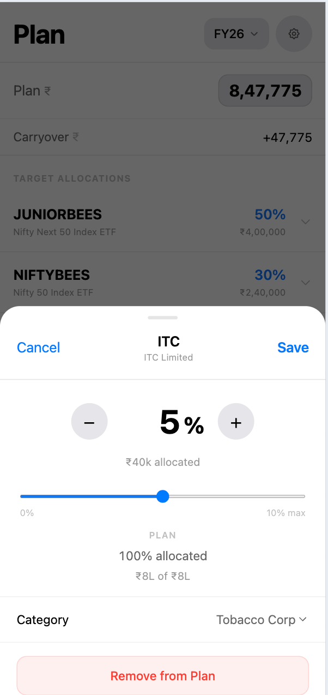

# Walkthrough

A screen-by-screen guide for new users — what each screen does and the order to set things up.

---

## Table of Contents

1. [First-time setup](#1-first-time-setup)
2. [Create your first plan](#2-create-your-first-plan)
3. [Allocation screen](#3-allocation-screen)
4. [Buy Bands](#4-buy-bands)
   - [Reading the band bar](#reading-the-band-bar)
   - [Investability](#investability)
   - [Tranches](#tranches)
5. [Logging transactions](#5-logging-transactions)
6. [Plan management](#6-plan-management)
   - [Editing allocations](#editing-allocations)
   - [Starting a new fiscal year](#starting-a-new-fiscal-year)
7. [Settings](#7-settings)

---

## 1. First-time setup

Sign up at the login screen with your email and password. Once in, you land on the **Allocation** screen — which will be empty until you create a plan.

The five tabs at the bottom are your main navigation:

| Tab | What it does |
|-----|-------------|
| Allocation | Home screen — deployment status per stock |
| Buy Bands | Valuation zones + planned buy orders |
| + | Log a new transaction |
| Transactions | Full buy/sell history |
| Plan | Manage your annual plan |

---

## 2. Create your first plan

Go to **Plan** → tap **+ Add Stock**.

Fill in:
- **Fiscal Year label** — use the year the FY *starts* in. FY26 = Apr 2026 – Mar 2027. FY25 = Apr 2025 – Mar 2026.
- **Total Budget (₹)** — your total capital for the year, e.g. `2400000` for ₹24L.

Tap **Create**. Your plan appears. Now add stocks:

1. Tap **+ Add Stock**
2. Enter the NSE symbol (e.g. `INFY`, `BEL`, `CAMS`)
3. Set the **allocation %** — what share of your budget goes to this stock
4. Choose a **category** — this drives which valuation model is used for buy bands (see [Buy Bands](#4-buy-bands))
5. Tap **Add Stock**

Repeat until your allocations sum to 100%. The header shows `X% · Y% left` as you go.

> **Tip:** You don't have to hit exactly 100% — but it's a good forcing function to be deliberate about every rupee.

<div align="center">
  
</div>

---

## 3. Allocation screen

Once your plan is set up, the **Allocation** tab shows the deployment status for the current fiscal year.

Each stock row shows:
- **Allocated budget** — your % × total budget
- **Deployed** — total spent (sum of buy transactions minus sells)
- **Remaining** — budget left to deploy
- **P&L** — unrealised gain/loss if a CMP is available

Stocks are sorted with the most under-deployed at the top, so you can see at a glance where budget is still available.

<div align="center">
  
</div>

---

## 4. Buy Bands

The **Buy Bands** tab shows valuation zones for each stock — price ranges where the stock is cheap, fairly valued, or expensive based on your playbook rules.

At the top of the screen, the primary action row is reserved for two operational actions:
- **Refresh CMP** — updates current market prices from NSE
- **Regen Bands** — recomputes zones from saved financials

<div align="center">
  
</div>

Tap any stock row to open its detail screen.

### Reading the band bar

The band bar at the top of a stock's detail screen maps price to valuation zone. The white vertical line shows the current market price (CMP).

```
| DEEP | BUY (green) | WAIT | MID (orange) | TRIM (red) |
                              ↑
                          CMP (white line)
```

| Zone | What it means |
|------|--------------|
| **Deep** | Well below fair value; highest conviction entry |
| **Buy** | Cheap; good time to deploy budget |
| **Wait** | Borderline — neither a clear buy nor a mid hold |
| **Mid** | Fairly valued; hold existing position, avoid adding |
| **Trim** | Expensive relative to fundamentals; consider reducing |

Below the band bar, the detail screen shows the 52W low/high, current price, your allocation figures, and links to Financials and Band Computation.

To regenerate financials and bands, use the two buttons in the action row:
1. **Regen Bands** → fetches latest financials from Screener.in / NSE and recomputes zones

Tap **Refresh CMP** to pull the latest price.

<div align="center">
  
</div>

### Investability

Tap the **Investability** row on a stock's detail screen to open the scorecard sheet.

The scorecard rates a stock across 10 qualitative gates (Moat, Owner Earnings, Capital Efficiency, Innovation, Execution Track, Sector Winds, Governance, and more) on a 0–5 scale. The total score out of 50 determines whether the stock is classed as **Investable**, **Borderline**, or **Avoid**.

Tap **Regenerate** to have AI (Gemini 2.5 Flash) score the stock automatically. You can also adjust any gate manually with the **–** / **+** buttons. Gates marked **hard veto** (e.g. Governance) will override the total score if set to 0.

Requires a Gemini API key in Settings (see [Settings](#7-settings)).

<div align="center">
  
</div>

### Snowball Check

Tap the **Snowball** row on a stock's detail screen (visible when you hold shares) to see whether the fundamentals support buying right now.

Snowball combines the price zone with three trend conditions:

| Condition | Passes when |
|-----------|-------------|
| **Growth > 12% CAGR** | 3-year PAT CAGR exceeds 12% |
| **Margin improving** | Current op margin > prior snapshot |
| **Growth holding** | Current g > prior g |

The result is a single signal:

| Signal | Meaning |
|--------|---------|
| **Add Aggressively** | In buy/deep zone, all 3 conditions pass |
| **Add Slowly** | In buy/deep zone, 1–2 conditions pass |
| **Wait** | Mid/Watch zone, or 0/3 conditions |
| **Trim** | CMP above trim price |

The signal also appears as a pill on the Buy Levels sheet header and inline on the Snowball row.

Snowball requires two saved snapshots (current + one prior) to evaluate the trend conditions. Run **Regen Financials** across two separate sessions to build the comparison.

### Tranches

Tranches let you plan *how* you want to buy within the Buy zone — breaking a position into multiple orders at different price points.

Tap **Buy Levels** at the bottom of a stock's detail screen to open the tranches sheet. Tap **Generate** to auto-generate tranches from the current bands and remaining budget.

Tranche generation:
- Prices are spread within the Buy zone, with the ceiling capped at CMP (no point placing a limit above the current price)
- When CMP is above the Buy zone, tranches are spread across the full zone as target limit orders
- When CMP is in Deep Value (below buy low), 2–3 tranches are spaced 5% apart below CMP
- Qty per tranche is auto-calculated from your FY remaining budget; deeper tranches receive more capital (conviction-weighted)
- The Buy Levels sheet shows a descriptor line — e.g. "5 tranches · Aggressive" — when tranches are generated with a Snowball signal active

Generating replaces all existing tranches for that stock and FY.

You can also add tranches manually — tap **+ Add** in the Buy Levels sheet:
- **Qty** — number of shares
- **Price ₹** — your target price

Tranches are planning levels only. Actual deployment is tracked from real buy/sell transactions, not by marking tranches as filled.

Tranches are scoped to your fiscal year — they don't carry over to the next year.

<div align="center">
  
</div>

---

## 5. Logging transactions

Tap the **+** button in the bottom nav to log a trade.

1. Tap the stock chip (loaded from your current plan)
2. Select **Buy** or **Sell**
3. Set the date, quantity, and price
4. Tap the Buy/Sell button to save

The amount is computed automatically. The transaction is linked to the fiscal year whose date range contains the trade date.

Once logged, the **Allocation** screen updates the Deployed and Remaining numbers for that stock.

<div align="center">
  
</div>

---

## 6. Plan management

### Editing allocations

From the **Plan** tab:
- **Edit budget** — tap Edit next to the budget figure
- **Change allocation %** — tap a stock row to open its edit sheet; use the slider or +/– buttons
- **Change category** — in the stock edit sheet, tap the Category dropdown
- **Remove a stock** — in the stock edit sheet, tap **Remove from Plan** (transactions are kept)
- **Add a stock** — tap + Add Stock at the top of the list

The header always shows the live total % so you know if you're over or under.

<div align="center">
  
</div>

### Starting a new fiscal year

At the end of a fiscal year, tap **+ Add Plan** in the Plan tab.

- Enter the new FY label (e.g. `FY27` for Apr 2027 – Mar 2028)
- Set a new budget
- Optionally **copy stocks** from your current plan — allocation %s and categories carry over
- Carryover is computed automatically: unspent budget per stock flows into the new plan as a bonus on top of the new budget

The previous plan stays accessible via the FY selector in the Plan and Buy Bands tabs.

---

## 7. Settings

Tap the **profile icon** (top right on any screen) to open the account menu.

The settings menu is grouped into sections. Only sections with multiple items use internal dividers; the menu should not show a horizontal rule after every section.

### Gemini API key

Required for AI investability scoring. The first time you tap Regenerate in the Investability sheet without a key, a prompt slides up asking you to add one.

**How to get a free key:**
1. Go to [aistudio.google.com](https://aistudio.google.com)
2. Sign in with a Google account
3. Create an API key (free tier is sufficient)
4. Copy the key — it starts with `AIza…`

Paste it into the prompt and tap **Save**. Generation will proceed immediately.

**Security:** your key is saved to your private account in the database. It is only accessible via your login, never visible to other users, and is only ever used server-side when calling Gemini — it never appears in your browser after saving. See [architecture.md](architecture.md#user-api-key-security) for the full security model.

To update or remove the key later, tap the profile icon → **AI Settings**.

### Valuation

The global 10Y yield used for valuation is available from the Buy Bands screen via the profile icon → **Valuation** → **Set 10Y Yield**.
